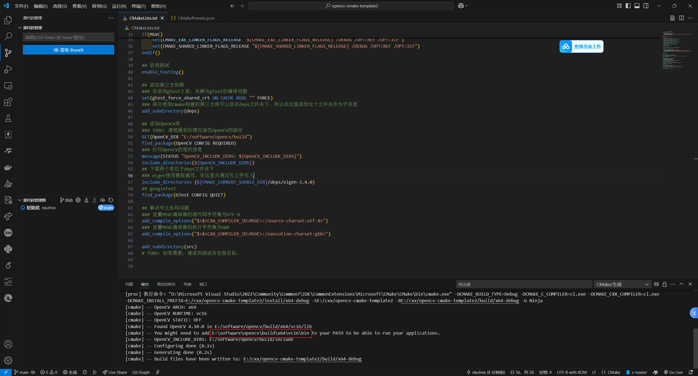

# opencv-cmake-template

## 简介

这是一个在Windows系统上使用CMake构建OpenCV项目的模板项目，包含以下三个第三方库：

- OpenCV
- Eigen
- Googletest

## 如何使用

确保电脑上已经安装Visual Studio 2019或更高版本。

首先安装[OpenCV](https://opencv.org/releases/)，然后克隆本仓库

```shell
git clone https://github.com/nkufree/opencv-cmake-template.git
```

修改根目录中的CMakeLists.txt文件，将OpenCV的安装目录中的`build`文件夹设置为`OpenCV_DIR`变量的值，如：

```cmake
set(OpenCV_DIR "E:/software/opencv/build")
```

然后将可执行程序加入环境变量，在OpenCV的4.10.0版本中，该路径为：

```shell
<安装目录>\build\x64\vc16\bin
```

如果不清楚该使用哪个路径，在后续构建该CMake项目时，CMake会给出提示，如



之后使用Visual Studio或者VSCode打开均可，VSCode需要安装插件CMake Tools和CMake，具体的使用方式可以参考其他教程。
